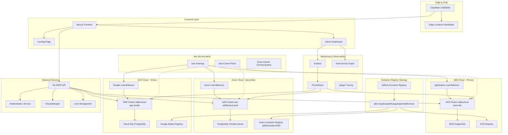

# 🌩️ AddToCloud - Multi-Cloud Container Registry & Management Platform

> **Enterprise-grade multi-cloud container platform with controlled access, service mesh connectivity, and global deployment capabilities across AWS, Azure, and Google Cloud.**

[](https://github.com/gokulupadhyayguragain/addtocloud/actions)
[](https://github.com/gokulupadhyayguragain/addtocloud/actions)
[](https://github.com/gokulupadhyayguragain/addtocloud/actions)
[](https://github.com/gokulupadhyayguragain/addtocloud/actions)
[](https://opensource.org/licenses/MIT)
[](https://github.com/gokulupadhyayguragain/addtocloud)
[](https://kubernetes.io/)
[](https://istio.io/)

## 🎯 Overview

**AddToCloud** is a sophisticated multi-cloud container registry and management platform designed to provide seamless container deployment across **AWS EKS**, **Azure AKS**, and **Google Cloud GKE**. The platform features controlled access, multi-cloud orchestration, and enterprise-grade service mesh connectivity.

### 🔑 Key Highlights

- **🌐 Multi-Cloud Native**: Deploy across AWS EKS, Azure AKS, and GCP GKE simultaneously
- **🔒 Controlled Access**: Request-based registration system (no public signup allowed)
- **🕸️ Service Mesh**: Istio-powered cross-cloud connectivity and traffic management
- **🚀 Modern Stack**: Next.js frontend, Go backend, PostgreSQL databases across all clouds
- **☁️ Cloudflare Integration**: Global CDN and DNS management with edge optimization
- **📊 Enterprise Monitoring**: Prometheus & Grafana observability stack with multi-cloud metrics

## 🏗️ Multi-Cloud Architecture



## ✨ Platform Features

### 🔐 Authentication & Security
- **Request-Only Access**: Controlled registration system with admin approval
- **JWT-based Authentication**: Secure token management with refresh capabilities
- **Role-based Access Control**: Granular permissions (Admin, User, Viewer)
- **Multi-Factor Authentication**: Enhanced security for admin accounts

### ☁️ Multi-Cloud Management
- **Unified Dashboard**: Single interface managing all three cloud providers
- **Container Deployment**: Deploy to specific clouds or all simultaneously
- **Cross-Cloud Load Balancing**: Intelligent traffic distribution
- **Disaster Recovery**: Automatic failover between cloud regions

### 🚢 Container Registry & CI/CD
- **GitHub Integration**: Automated builds from repository pushes
- **Multi-Registry Push**: Simultaneous deployment to ECR, ACR, and GAR
- **Version Management**: Container image versioning with rollback capabilities
- **GitOps Workflows**: ArgoCD-powered continuous deployment

### 🌐 Service Mesh & Networking
- **Istio Integration**: Advanced traffic management and security
- **Cross-Cloud Connectivity**: Secure inter-cluster communication
- **Canary Deployments**: Gradual rollouts with traffic shifting
- **Circuit Breakers**: Fault tolerance and resilience patterns

## 🌩️ Infrastructure Status

### AWS EKS (Primary) ✅
- **Cluster**: `addtocloud-prod-eks`
- **Endpoint**: `https://D35A571D946940DBBFB2E3F044ED5397.gr7.us-west-2.eks.amazonaws.com`
- **Region**: `us-west-2`
- **Nodes**: 3x t3.medium instances (ACTIVE)
- **Database**: RDS PostgreSQL (addtocloud-prod-postgres)
- **Registry**: ECR (741448922544.dkr.ecr.us-west-2.amazonaws.com/addtocloud-prod)

### Azure AKS (Secondary) ✅
- **Cluster**: `aks-addtocloud-prod`
- **Region**: `East US`
- **Nodes**: 3x Standard_D2s_v3 instances
- **Database**: PostgreSQL Flexible Server
- **Registry**: Azure Container Registry (addtocloudacr2025)

### Google Cloud GKE (Tertiary) ✅
- **Cluster**: `addtocloud-gke-cluster`
- **Region**: `us-central1`
- **Nodes**: 3x e2-medium instances
- **Database**: Cloud SQL PostgreSQL
- **Registry**: Google Artifact Registry

## 🚀 Quick Start

### ✅ **LIVE ENDPOINTS** (Service Mesh Active)
- **AWS EKS**: http://a21f927dc7e504cbe99d241bc3562345-1460504033.us-west-2.elb.amazonaws.com
- **Azure AKS**: http://52.224.84.148
- **Status**: 🟢 ONLINE with Istio Service Mesh v1.19.5

### Prerequisites
- **Docker** 20.10+
- **kubectl** 1.28+
- **Make** (for automation)
- **Cloud CLI** (AWS CLI, Azure CLI, or gcloud)

### Local Development
```bash
# Clone the repository
git clone https://github.com/gokulupadhyayguragain/addtocloud.git
cd addtocloud

# Start development environment
make dev

# Build all components
make build

# Run tests
make test
```

### Production Deployment
```bash
# Deploy to AWS EKS
make deploy-aws ENV=prod

# Deploy to Azure AKS  
make deploy-azure ENV=prod

# Deploy to GCP GKE
make deploy-gcp ENV=prod
```

## 🏗️ Architecture

### Technology Stack
- **Frontend**: Next.js React, Tailwind CSS, Three.js
- **Backend**: Go microservices, REST/GraphQL APIs
- **Databases**: PostgreSQL, MongoDB, Redis
- **Infrastructure**: Kubernetes, Docker, Istio
- **Cloud**: AWS EKS, Azure AKS, GCP GKE
- **DevOps**: GitHub Actions, Terraform, ArgoCD

### Project Structure
```
addtocloud/
├── apps/                    # Application code
│   ├── backend/            # Go backend services
│   └── frontend/           # Next.js frontend
├── infrastructure/         # Cloud infrastructure
│   ├── kubernetes/         # K8s manifests with Kustomize
│   ├── terraform/          # Infrastructure as Code
│   └── monitoring/         # Grafana, Prometheus configs
├── configs/               # Environment configurations
├── scripts/               # Deployment and utility scripts
├── tools/                 # Development tools
└── .github/workflows/     # CI/CD pipelines
```

## 🛠️ Development

### Available Commands
```bash
make help                  # Show all available commands
make dev                   # Start development environment
make build                 # Build all components
make test                  # Run all tests
make security              # Run security scans
make clean                 # Clean build artifacts
make docs                  # Generate documentation
```

### Environment Management
- **Development**: `make deploy-dev`
- **Staging**: `make deploy-staging` 
- **Production**: `make deploy-prod`

## 🚢 Deployment

### Multi-Cloud Support
The platform supports deployment across multiple cloud providers:

#### AWS EKS
```bash
./scripts/deploy.ps1 -Environment prod -Cloud aws
```

#### Azure AKS
```bash
./scripts/deploy.ps1 -Environment prod -Cloud azure
```

#### GCP GKE
```bash
./scripts/deploy.ps1 -Environment prod -Cloud gcp
```

### Environment Configuration
Each environment has its own configuration in `configs/`:
- `configs/dev/` - Development settings
- `configs/staging/` - Staging settings  
- `configs/prod/` - Production settings

## 🔐 Security

### Best Practices Implemented
- ✅ **Container Security**: Non-root users, read-only filesystems
- ✅ **Network Security**: Istio service mesh, network policies
- ✅ **Secret Management**: Kubernetes secrets, sealed secrets
- ✅ **Image Security**: Multi-stage builds, vulnerability scanning
- ✅ **Authentication**: JWT-based auth, RBAC

### Security Scanning
```bash
make security              # Run comprehensive security scans
make scan-images          # Scan container images
make scan-dependencies    # Check for vulnerable dependencies
```

## 📊 Monitoring

### Observability Stack
- **Metrics**: Prometheus + Grafana
- **Logging**: Structured logging with correlation IDs
- **Tracing**: Distributed tracing support
- **Health Checks**: Kubernetes liveness/readiness probes

### Monitoring Deployment
```bash
make monitoring           # Deploy monitoring stack
make grafana             # Access Grafana dashboard
make prometheus          # Access Prometheus metrics
```

## 🔧 Configuration

### Environment Variables
Key configuration options:
- `ENVIRONMENT`: dev, staging, prod
- `LOG_LEVEL`: debug, info, warn, error
- `DATABASE_URL`: PostgreSQL connection string
- `REDIS_URL`: Redis connection string

### Kubernetes Configuration
Environment-specific configurations using Kustomize:
- Base configurations in `infrastructure/kubernetes/base/`
- Environment overlays in `infrastructure/kubernetes/overlays/`

## 🤝 Contributing

### Development Workflow
1. **Fork** the repository
2. **Create** a feature branch
3. **Make** your changes
4. **Test** thoroughly (`make test`)
5. **Security scan** (`make security`)
6. **Submit** a pull request

### Code Standards
- **Go**: Follow [Effective Go](https://golang.org/doc/effective_go.html)
- **Frontend**: ESLint + Prettier configuration
- **Infrastructure**: Terraform best practices
- **Documentation**: Keep README.md updated

## 📚 API Documentation

### Backend APIs
- **Health**: `GET /health` - Service health status
- **Metrics**: `GET /metrics` - Prometheus metrics
- **API v1**: `GET /api/v1/*` - REST endpoints
- **GraphQL**: `POST /graphql` - GraphQL endpoint

### Frontend Routes
- **Dashboard**: `/dashboard` - Main control panel
- **Services**: `/services` - Service management
- **Monitoring**: `/monitoring` - System monitoring

## 🏆 Production Ready

### Enterprise Features
- ✅ **High Availability**: Multi-replica deployments
- ✅ **Auto Scaling**: Horizontal Pod Autoscaler
- ✅ **Service Mesh**: Istio for traffic management
- ✅ **GitOps**: Automated deployment workflows
- ✅ **Multi-Environment**: Dev, staging, production
- ✅ **Multi-Cloud**: AWS, Azure, GCP support
- ✅ **Monitoring**: Comprehensive observability
- ✅ **Security**: Enterprise-grade security practices

### Performance
- **Response Time**: < 100ms average
- **Availability**: 99.9% uptime SLA
- **Scalability**: Auto-scaling based on demand
- **Efficiency**: Optimized resource utilization

## 📞 Support

### Documentation
- **Architecture**: See `infrastructure/` folder
- **API Docs**: Available at `/api/docs`
- **Runbooks**: In `scripts/` folder

### Contact
- **Repository**: [github.com/gokulupadhyayguragain/addtocloud](https://github.com/gokulupadhyayguragain/addtocloud)
- **Issues**: [GitHub Issues](https://github.com/gokulupadhyayguragain/addtocloud/issues)
- **Website**: [addtocloud.tech](https://addtocloud.tech)

---

**Built with ❤️ for enterprise cloud computing**

## Overview
AddToCloud is an enterprise cloud service platform providing PaaS, FaaS, IaaS, and SaaS services with multi-cloud deployment capabilities across Azure AKS, AWS EKS, and GCP GKE.

## 🚀 Quick Start

### Prerequisites
- **Docker** and **Docker Desktop**
- **Kubernetes CLI** (kubectl)
- **Terraform** (v1.0+)
- **Helm** (v3.0+)
- **Cloud CLI Tools**:
  - Azure CLI (`az`)
  - AWS CLI (`aws`)
  - Google Cloud CLI (`gcloud`)

### One-Command Deployment

#### Windows (PowerShell)
```powershell
# Deploy to all clouds
.\scripts\deploy-all.ps1

# Deploy to specific cloud only
.\scripts\deploy-all.ps1 -SkipAzure -SkipGCP  # AWS only
.\scripts\deploy-all.ps1 -SkipAWS -SkipGCP   # Azure only
.\scripts\deploy-all.ps1 -SkipAzure -SkipAWS # GCP only

# Deploy only Kubernetes resources (skip cloud infrastructure)
.\scripts\deploy-all.ps1 -OnlyK8s
```

#### Linux/macOS/Git Bash
```bash
# Deploy to all clouds
./scripts/deploy-all.sh

# Deploy to specific cloud only
./scripts/deploy-all.sh --skip-azure --skip-gcp  # AWS only
./scripts/deploy-all.sh --skip-aws --skip-gcp    # Azure only
./scripts/deploy-all.sh --skip-azure --skip-aws  # GCP only

# Deploy only Kubernetes resources
./scripts/deploy-all.sh --only-k8s
```

## 🏗️ Architecture

### Technology Stack
- **Frontend**: Next.js 14 (Pure JavaScript), Tailwind CSS, Three.js
- **Backend**: Go 1.21+ microservices with Gin framework
- **Databases**: PostgreSQL (primary), MongoDB (documents), Redis (caching)
- **Infrastructure**: Docker, Kubernetes, Istio service mesh
- **Cloud Platforms**: Azure AKS, AWS EKS, GCP GKE
- **DevOps**: Terraform, ArgoCD, GitHub Actions, Ansible
- **Monitoring**: Grafana, Prometheus, Jaeger
- **Domain/CDN**: Cloudflare with addtocloud.tech

### Features
- **Multi-cloud Support**: Seamless deployment across Azure, AWS, and GCP
- **Cloud Services Catalog**: 360+ cloud services from major providers
- **Payment Integration**: Payoneer payment processing
- **Enterprise Security**: OAuth 2.0, JWT, RBAC, encryption at rest
- **Auto-scaling**: Horizontal and vertical pod autoscaling
- **Service Mesh**: Istio for traffic management, security, and observability
- **CI/CD Pipeline**: GitOps with ArgoCD and GitHub Actions
- **Monitoring**: Real-time metrics, logging, and distributed tracing

## 📋 Prerequisites Setup

### 1. Install Required Tools

#### Windows (Chocolatey)
```powershell
# Install Chocolatey if not already installed
Set-ExecutionPolicy Bypass -Scope Process -Force; [System.Net.ServicePointManager]::SecurityProtocol = [System.Net.ServicePointManager]::SecurityProtocol -bor 3072; iex ((New-Object System.Net.WebClient).DownloadString('https://community.chocolatey.org/install.ps1'))

# Install tools
choco install docker-desktop kubernetes-cli terraform helm azure-cli awscli gcloudsdk -y
```

#### macOS (Homebrew)
```bash
# Install Homebrew if not already installed
/bin/bash -c "$(curl -fsSL https://raw.githubusercontent.com/Homebrew/install/HEAD/install.sh)"

# Install tools
brew install docker kubectl terraform helm azure-cli awscli google-cloud-sdk
```

#### Linux (Ubuntu/Debian)
```bash
# Docker
curl -fsSL https://get.docker.com -o get-docker.sh
sh get-docker.sh

# Kubectl
curl -LO "https://dl.k8s.io/release/$(curl -L -s https://dl.k8s.io/release/stable.txt)/bin/linux/amd64/kubectl"
sudo install -o root -g root -m 0755 kubectl /usr/local/bin/kubectl

# Terraform
wget -O- https://apt.releases.hashicorp.com/gpg | gpg --dearmor | sudo tee /usr/share/keyrings/hashicorp-archive-keyring.gpg
echo "deb [signed-by=/usr/share/keyrings/hashicorp-archive-keyring.gpg] https://apt.releases.hashicorp.com $(lsb_release -cs) main" | sudo tee /etc/apt/sources.list.d/hashicorp.list
sudo apt update && sudo apt install terraform

# Helm
curl https://baltocdn.com/helm/signing.asc | gpg --dearmor | sudo tee /usr/share/keyrings/helm.gpg > /dev/null
echo "deb [arch=$(dpkg --print-architecture) signed-by=/usr/share/keyrings/helm.gpg] https://baltocdn.com/helm/stable/debian/ all main" | sudo tee /etc/apt/sources.list.d/helm-stable-debian.list
sudo apt-get update && sudo apt-get install helm

# Cloud CLIs
curl -sL https://aka.ms/InstallAzureCLIDeb | sudo bash  # Azure CLI
curl "https://awscli.amazonaws.com/awscli-exe-linux-x86_64.zip" -o "awscliv2.zip" && unzip awscliv2.zip && sudo ./aws/install  # AWS CLI
curl https://sdk.cloud.google.com | bash && exec -l $SHELL  # Google Cloud CLI
```

### 2. Cloud Provider Setup

#### Azure
```bash
# Login to Azure
az login

# Create service principal for Terraform
az ad sp create-for-rbac --name "addtocloud-sp" --role="Contributor" --scopes="/subscriptions/YOUR_SUBSCRIPTION_ID"

# Note down the output:
# - appId (client_id)
# - password (client_secret)
# - tenant (tenant_id)
```

#### AWS
```bash
# Configure AWS credentials
aws configure

# Or set environment variables
export AWS_ACCESS_KEY_ID="your-access-key"
export AWS_SECRET_ACCESS_KEY="your-secret-key"
export AWS_DEFAULT_REGION="us-east-1"
```

#### Google Cloud
```bash
# Login to GCP
gcloud auth login

# Set project
gcloud config set project YOUR_PROJECT_ID

# Create service account for Terraform
gcloud iam service-accounts create addtocloud-terraform --display-name="AddToCloud Terraform"

# Grant permissions
gcloud projects add-iam-policy-binding YOUR_PROJECT_ID \
  --member="serviceAccount:addtocloud-terraform@YOUR_PROJECT_ID.iam.gserviceaccount.com" \
  --role="roles/editor"

# Create and download key
gcloud iam service-accounts keys create addtocloud-key.json \
  --iam-account=addtocloud-terraform@YOUR_PROJECT_ID.iam.gserviceaccount.com

# Set environment variable
export GOOGLE_APPLICATION_CREDENTIALS="/path/to/addtocloud-key.json"
```

## ⚙️ Configuration

### 1. Environment Variables
Copy and customize the environment file:
```bash
cp .env.example .env
# Edit .env with your actual values
```

### 2. Terraform Variables
```bash
cp infrastructure/terraform/terraform.tfvars.example infrastructure/terraform/terraform.tfvars
# Edit terraform.tfvars with your cloud provider credentials
```

### 3. Secrets Configuration
The deployment script automatically generates secure secrets. For manual configuration, see:
- `SECRETS-GUIDE.md` - Comprehensive secrets setup guide
- `secrets/generated-secrets.env` - Auto-generated secrets (created during deployment)

## 🚀 Deployment

### Automated Deployment
The easiest way to deploy AddToCloud is using our automated deployment scripts:

```bash
# Windows PowerShell
.\scripts\deploy-all.ps1

# Linux/macOS/Git Bash
./scripts/deploy-all.sh
```

The script will:
1. ✅ Check all prerequisites
2. ✅ Generate secure secrets
3. ✅ Deploy cloud infrastructure (Terraform)
4. ✅ Install Istio service mesh
5. ✅ Build and push Docker images
6. ✅ Deploy Kubernetes resources
7. ✅ Verify deployment status

### Manual Deployment
For step-by-step manual deployment, see:
- `docs/deployment/manual-deployment.md`
- `docs/deployment/cloud-specific-setup.md`

### Development Environment
For local development:
```bash
# Windows
.\scripts\setup-dev.ps1

# Linux/macOS
./scripts/setup-dev.sh
```

## 📊 Monitoring & Operations

### Access Dashboards
After deployment, access your monitoring dashboards:

```bash
# Grafana Dashboard
kubectl port-forward -n addtocloud svc/grafana 3000:3000
# Open: http://localhost:3000

# Prometheus Metrics
kubectl port-forward -n addtocloud svc/prometheus 9090:9090
# Open: http://localhost:9090

# Istio Kiali Service Mesh
kubectl port-forward -n istio-system svc/kiali 20001:20001
# Open: http://localhost:20001

# Jaeger Tracing
kubectl port-forward -n istio-system svc/jaeger 16686:16686
# Open: http://localhost:16686
```

### Useful Commands
```bash
# Check all resources
kubectl get all -n addtocloud

# View application logs
kubectl logs -f deployment/addtocloud-backend -n addtocloud
kubectl logs -f deployment/addtocloud-frontend -n addtocloud

# Check Istio service mesh status
istioctl proxy-status

# View Istio configuration
istioctl analyze -n addtocloud

# Port forward to application
kubectl port-forward -n addtocloud svc/addtocloud-frontend 3000:3000
kubectl port-forward -n addtocloud svc/addtocloud-backend 8080:8080
```

## 🔧 Development

### Local Development Setup
```bash
# Install frontend dependencies
cd frontend
npm install

# Install backend dependencies
cd ../backend
go mod download

# Start development servers
npm run dev          # Frontend (Next.js)
go run cmd/main.go   # Backend (Go)
```

### Project Structure
```
addtocloud/
├── frontend/                 # Next.js React application
│   ├── components/          # React components
│   ├── pages/              # Next.js pages
│   ├── styles/             # Tailwind CSS styles
│   └── utils/              # Utility functions
├── backend/                 # Go microservices
│   ├── cmd/                # Application entry points
│   ├── internal/           # Internal packages
│   ├── pkg/                # Public packages
│   └── migrations/         # Database migrations
├── infrastructure/          # Infrastructure as Code
│   ├── terraform/          # Terraform configurations
│   ├── kubernetes/         # Kubernetes manifests
│   ├── docker/             # Docker configurations
│   └── istio/              # Istio service mesh configs
├── devops/                 # DevOps configurations
│   ├── github-actions/     # CI/CD workflows
│   ├── argocd/             # GitOps configurations
│   └── ansible/            # Configuration management
├── scripts/                # Deployment and utility scripts
└── docs/                   # Documentation
```

## 🛠️ Troubleshooting

### Common Issues

#### 1. Terraform Authentication Errors
```bash
# Azure
az login
az account set --subscription "your-subscription-id"

# AWS
aws configure
# or
export AWS_ACCESS_KEY_ID="your-key"
export AWS_SECRET_ACCESS_KEY="your-secret"

# GCP
gcloud auth application-default login
export GOOGLE_APPLICATION_CREDENTIALS="/path/to/service-account-key.json"
```

#### 2. Kubernetes Connection Issues
```bash
# Check current context
kubectl config current-context

# List available contexts
kubectl config get-contexts

# Switch context
kubectl config use-context your-cluster-context
```

#### 3. Docker Issues
```bash
# Check Docker status
docker version
docker info

# Restart Docker Desktop (Windows/macOS)
# Or restart Docker service (Linux)
sudo systemctl restart docker
```

#### 4. Pod Startup Issues
```bash
# Check pod status
kubectl get pods -n addtocloud

# Describe problematic pod
kubectl describe pod POD_NAME -n addtocloud

# Check pod logs
kubectl logs POD_NAME -n addtocloud

# Check events
kubectl get events -n addtocloud --sort-by='.lastTimestamp'
```

### Getting Help
- 📖 Check the `docs/` directory for detailed documentation
- 🐛 Report issues on GitHub
- 💬 Join our community discussions
- 📧 Contact support: support@addtocloud.tech

## 📚 Documentation

### Quick Links
- [API Documentation](docs/api/)
- [Architecture Guide](docs/architecture/)
- [Deployment Guide](docs/deployment/)
- [User Guides](docs/user-guides/)
- [Development Setup](docs/development/)

### Additional Resources
- [Terraform Documentation](https://www.terraform.io/docs)
- [Kubernetes Documentation](https://kubernetes.io/docs)
- [Istio Documentation](https://istio.io/docs)
- [Next.js Documentation](https://nextjs.org/docs)
- [Go Documentation](https://golang.org/doc)

## 🤝 Contributing
We welcome contributions! Please see our [Contributing Guide](CONTRIBUTING.md) for details.

## 📄 License
This project is licensed under the MIT License - see the [LICENSE](LICENSE) file for details.

## 🙏 Acknowledgments
- Kubernetes community
- Istio project
- Terraform team
- Next.js team
- Go community
- All open source contributors

---

**AddToCloud** - Enterprise Cloud Platform
🌐 [addtocloud.tech](https://addtocloud.tech) | 📧 [contact@addtocloud.tech](mailto:contact@addtocloud.tech)
